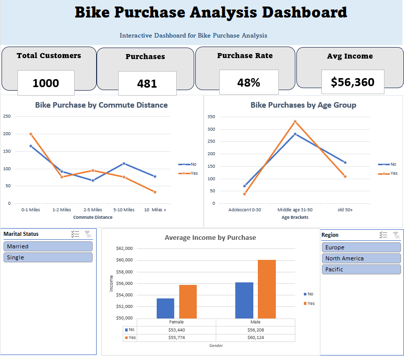

# Bike-Purchase-Analysis Dashboard

## 📌 Project Overview
This project presents an interactive Excel dashboard that analyzes customer bike purchase behavior using demographic and customer-related data. The dashboard allows users to explore purchasing patterns through interactive slicers and visualizations.

---

## 🎯 Objectives
- Analyze bike purchase behavior.
- Compare purchase decisions across different customer groups.
- Build an interactive dashboard for business analysis.

---

## 🛠️ Tools & Skills
- Microsoft Excel
- Pivot Tables
- Pivot Charts
- Slicers
- Data Cleaning
- Excel Formulas
- Dashboard Design

---

## 📊 Dashboard Features
- Interactive KPIs
  - Total Customers
  - Purchases
  - Purchase Rate
  - Average Income
- Purchase analysis by Age Group
- Purchase analysis by Commute Distance
- Average Income comparison
- Interactive filtering by Region and Marital Status

---

## 💡 Key Insights
- Customers aged (31–50) have the highest bike purchase count.
- Customers with shorter commute distances tend to purchase bikes more frequently.
- Customers who purchased bikes have a higher average income than those who did not.
- Region and marital status filters allow interactive exploration of customer purchasing behavior.

---

## 📂 Project Structure

```text
Bike_Purchase_Analysis_Dashboard.xlsx

├── Dashboard
├── Insights
├── Raw Data
├── Data Cleaning
├── Pivot Tables
└── KPI Calculations
```

---

## 📷 Dashboard Preview

> Add a screenshot of the dashboard here.

